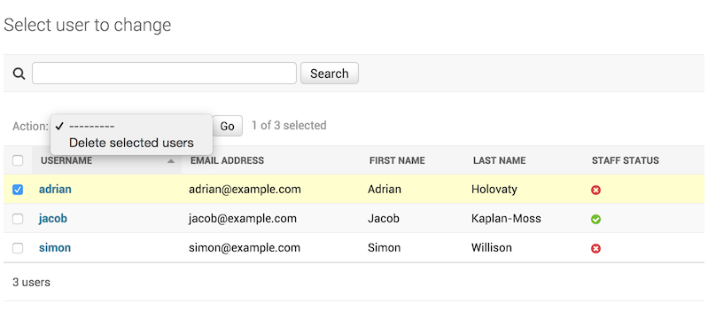

# Django Admin Actions

Admin action kısaca seçilen nesneler ile toplu iş uygulayabilme olayıdır, seçili bütün
kullanıcıları silmek gibi, aşağıda ki resim hangi konudan bahsettiğimizi anlatır
niteliktedir.



Bu içerikte **admin.py** dosyamıza yeni **actionlar** yazarak bazı toplu işlerimizi
kolaylaştıracağız.

benim aşağıdaki gibi bir modelim olsun, bu model ip banlamak için yazdım, banlanan ip
siteye giremeyecek girdiğinde hata alacaki, modelimiz aşağıdaki gibi.

**/models.py**

```python
from django.db import models

class IPModel(models.Model):
    address = models.GenericIPAddressField(unique=True, verbose_name="Ip address")
    ban = models.BooleanField(default=0)
```

## Action Fonsiyonu Yazımı

Action fonksiyonu normal fonksiyon olup 3 tane parametre alır bunlar

- ModelAdmin
- HttpRequest
- QuerySet

Bu fonksiyonumuz **ModelAdmin** ve **HttpRequest** 'i kullanmayacağız bunlar django için
gerekli parametreler biz **QuerySet**'i kullanacağız.

örneğin

```python
def remove_ban(modeladmin, request, queryset):
    queryset.update(ban=False)
```

Bu şekilde yazım performanslı yazımdır tabi isterseniz

```python
for obj in queryset:
    do_something_with(obj)
```

Bunun gibi şeylede yapabilirsiniz gelen nesne sizin verdiğiniz modeli kullanarak
oluşturulmuş bir **queryset** sonuçta.

```python
def remove_ban(modeladmin, request, queryset):
    queryset.update(ban=False)
remove_ban.short_description = 'Remove Ban'
```

Burada `remove_ban` fonksiyonumuza **short_description** adında bir atama yapıldığını
görünüyoruz bunun amacı django bu değişkeni admin panelde **list_display** olarak
kullanıyor. Şimdi modelim için admin tarafını yazalım. **/admin.py**

```python
from django.contrib.admin import ModelAdmin, site
from django.http import Http404

from .models import IPModel

def remove_ban(modeladmin, request, queryset):
    queryset.update(ban=False)
remove_ban.short_description = 'Remove Ban'

def banned(modeladmin, request, queryset):
    queryset.update(ban=True)
banned.short_description = 'Banned'

class IPAdmin(ModelAdmin):
    list_display = ["address", , "ban"]
    list_display_links = ["address",, "ban"]
    list_filter = ["ban"]
    search_fields = ["address"]
    fields = (
        ("address"),
        ("ban"),
    )
    actions = [remove_ban, banned]

site.register(IPModel,IPAdmin)
```

Yukarıdaki **admin.py** dosyamda iki tane admin action fonksiyonu yazdım ve
**modeladmin** sınıfıma bu actionları **actions = \[remove_ban, banned\]** şeklinde
yazdım, django artık **IPAdmin** nesnemde iki tane action olduğunu ve bunların
görevlerini biliyor.

şimdi admin sayfama gidip birden fazla ip adresi seçip bunları toplu olarak
banlayabilirim veya banını kaldırabilirim.
